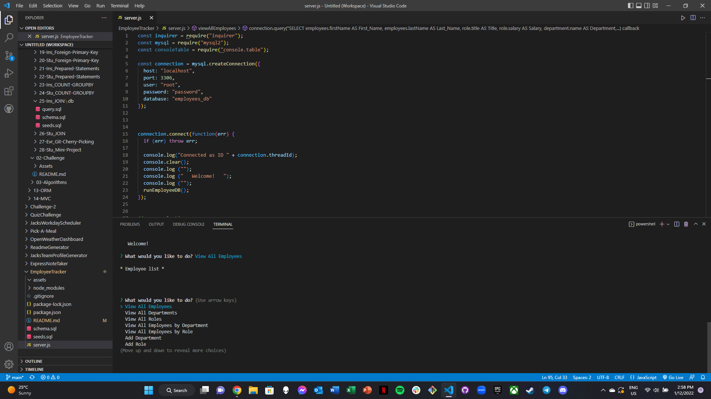

# EmployeeTracker

## Description

  The Employee Tracker app will allow the user to input employee information into a database. The app allows the user to view and manage the departments, roles, and employees within their business. This is to assist with managing the organisation and structure of their business. Existing information can also be edited, whilst new employees can still be added and sorted by department.

[Click Here For Walkthrough Demo Video](https://app.castify.com/view/efeca79f-89ef-4c3e-bc0e-f49222e0c03f)

Visit Project Link: https://github.com/jeco1988/EmployeeTracker

## Screenshot

## Table of Contents

- [Installation](#installation)
- [Usage](#usage)
- [Credits](#credits)
- [License](#license)

## Installation

- npm i inquirer
- npm i mysql
- npm i console.table
- Replace the MySql password to your own
- Save and then npm start

## Usage

- Please use npm start to execute the server.js file.
- Please navigate through all menu options, as required, and answer all prompts as necessary.
- Input data will be saved on the database and can be retrieved/edited at a later time.

## Credits

N/A

## License

Please refer to the repo.